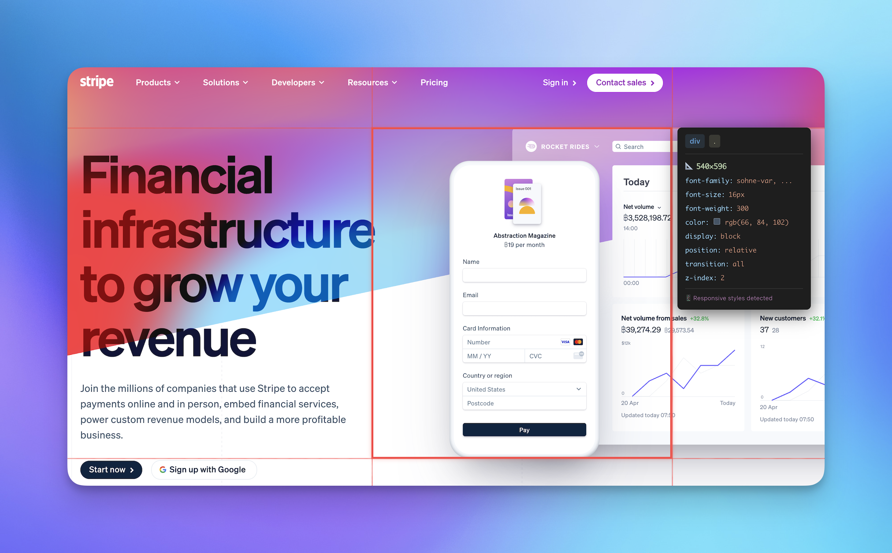

<p align="center">
  
</p>

<h1 align="center">Pointa</h1>

<p align="center">
  <strong>Point at any UI element, leave feedback, and let your AI coding agent implement the changes.</strong>
</p>

<p align="center">
  Point. Annotate. Let AI implement.
</p>

<p align="center">
  <a href="https://pointa.dev">Website</a> •
  <a href="#quick-start">Quick Start</a> •
  <a href="https://chromewebstore.google.com/detail/pointa/chfdkemckcihigkepbnpegcopkncoane">Chrome Extension</a> •
  <a href="https://www.npmjs.com/package/pointa-server">npm</a>
</p>

<p align="center">
  <a href="https://opensource.org/licenses/MIT"></a>
  <a href="https://chromewebstore.google.com/detail/pointa/chfdkemckcihigkepbnpegcopkncoane"></a>
  <a href="https://www.npmjs.com/package/pointa-server"></a>
  <a href="CONTRIBUTING.md"></a>
</p>

<br />

<p align="center">
  
</p>

<br />

## Table of Contents

- [What is Pointa?](#what-is-pointa)
- [Key Features](#key-features)
- [Quick Start](#quick-start)
- [AI Agent Setup](#ai-agent-setup)
- [Backend Log Capture](#backend-log-capture)
- [How It Works](#how-it-works)
- [Server Commands](#server-commands)
- [Troubleshooting](#troubleshooting)
- [Contributing](#contributing)
- [License](#license)

## What is Pointa?

Pointa is a browser extension and local server that lets you visually annotate your localhost projects. Click on any element, leave a comment, and your AI coding agent (Cursor, Claude Code, Windsurf, etc.) automatically implements the changes via MCP.

Think of it as visual issue tracking that your AI can read and act on — no more copying CSS selectors or describing which button you're talking about.

Annotate your localhost like you would a Figma screen:


Then ask your AI coding agent to implement the changes:


You can also use Pointa to...

**Report bugs in seconds**


**Bulk-fix annotations with your AI coding tool (via MCP)**


**Capture UI inspiration from other websites with clean screenshots and CSS metadata**



## Key Features

- 🎯 **Point and click annotations** — Click any element to leave feedback
- 🤖 **AI-ready** — Integrates with AI coding agents via MCP protocol
- 🏠 **Local-first** — Works on localhost, no cloud dependencies
- 📦 **Multi-page tracking** — Annotate across different routes and pages
- 🔒 **Privacy-focused** — All data stays on your machine
- 🐛 **Backend log capture** — Include server logs in bug reports with zero code changes

## Quick Start

### Prerequisites

- Node.js 18+
- A Chromium-based browser (Chrome, Edge, Brave, etc.)
- An AI coding agent that supports MCP (Cursor, Claude Code, Windsurf, etc.)

### 1. Install the browser extension

Install from the [Chrome Web Store](https://chromewebstore.google.com/detail/pointa/chfdkemckcihigkepbnpegcopkncoane) (recommended), or [load unpacked](docs/DEVELOPMENT.md) for development.

### 2. Connect your AI coding agent

Add the MCP server to your AI agent's configuration:

```json
{
  "mcpServers": {
    "pointa": {
      "command": "npx",
      "args": ["-y", "pointa-server"]
    }
  }
}
```

This automatically installs the server, starts the HTTP daemon for the extension, and keeps everything up to date. See [AI Agent Setup](#ai-agent-setup) for where to paste this in your specific tool.

### 3. Start annotating

1. Open your localhost app in the browser
2. Click the Pointa extension icon to activate
3. Click on any element to annotate
4. Add your feedback
5. Ask your AI agent to "implement the Pointa annotations"

## AI Agent Setup

<details>
<summary><b>Cursor</b></summary>

1. Open Settings → Cursor Settings
2. Go to Tools & Integrations tab
3. Click **+ Add new global MCP server**
4. Paste the MCP configuration:

```json
{
  "mcpServers": {
    "pointa": {
      "command": "npx",
      "args": ["-y", "pointa-server"]
    }
  }
}
```

5. Save and restart Cursor
</details>

<details>
<summary><b>Claude Code</b></summary>

Add to your Claude configuration file (`~/.config/claude/config.json`):

```json
{
  "mcpServers": {
    "pointa": {
      "command": "npx",
      "args": ["-y", "pointa-server"]
    }
  }
}
```

Or use the CLI:

```bash
claude mcp add --transport stdio pointa -- npx -y pointa-server
```
</details>

<details>
<summary><b>Windsurf</b></summary>

1. Navigate to Settings → Advanced Settings
2. Scroll to the Cascade section
3. Paste the MCP configuration:

```json
{
  "mcpServers": {
    "pointa": {
      "command": "npx",
      "args": ["-y", "pointa-server"]
    }
  }
}
```

4. Save and restart Windsurf
</details>

<details>
<summary><b>Antigravity</b></summary>

1. Click on **Agent session** in Antigravity
2. Select the **"..."** dropdown → **MCP Servers** → **Manage MCP Servers**
3. Click **View raw config**
4. Add the MCP configuration to `mcp_config.json`:

```json
{
  "mcpServers": {
    "pointa": {
      "command": "npx",
      "args": ["-y", "pointa-server"]
    }
  }
}
```

5. Save and restart Antigravity
</details>

<details>
<summary><b>Other Editors (VS Code, etc.)</b></summary>

Install an MCP-compatible AI extension and add the MCP configuration:

```json
{
  "mcpServers": {
    "pointa": {
      "command": "npx",
      "args": ["-y", "pointa-server"]
    }
  }
}
```

If your tool doesn't support the command/args format, use the HTTP endpoint instead:

```json
{
  "mcpServers": {
    "pointa": {
      "url": "http://127.0.0.1:4242/mcp"
    }
  }
}
```

(Requires manually running `pointa-server start` first)
</details>

## Backend Log Capture

Capture server-side logs in bug reports without any code changes. Wrap your dev command with `pointa dev`:

```bash
# Instead of:
npm run dev

# Run:
pointa dev npm run dev
```

This intercepts `console.log`, `console.error`, etc. from your Node.js server and includes them in bug report timelines. Works with any Node.js framework (Next.js, Express, Remix, etc.).

```bash
# Capture console logs only (default)
pointa dev npm run dev

# Capture full terminal output (stdout/stderr)
pointa dev --capture-stdout npm run dev
```

The capture mode can also be toggled in the extension's bug recording UI.

## How It Works

Pointa consists of two components:

```
┌─────────────────────────────────────────┐
│         Browser Extension               │
│  - UI for creating annotations          │
│  - Element selection & highlighting     │
│  - Annotation management interface      │
└───────────────┬─────────────────────────┘
                │
                │ HTTP API
                ▼
┌─────────────────────────────────────────┐
│         Local Server (Node.js)          │
│  - MCP server for AI agents             │
│  - HTTP API for extension               │
│  - File-based storage (~/.pointa)       │
└─────────────────────────────────────────┘
```

**Data Flow:**
```
User clicks element → Extension captures context → Server stores annotation
                                                            ↓
AI Agent ← MCP Protocol ← Server provides annotation data
```

## Server Commands

```bash
pointa-server start     # Start the server
pointa-server status    # Check server status
pointa-server stop      # Stop the server
pointa-server restart   # Restart the server
```

If you use the `npx` approach from Quick Start, the server is managed automatically.

## Troubleshooting

**Server not detected**
- Run `pointa-server status` to check if it's running
- Make sure port 4242 is not blocked by a firewall

**Extension not working**
- Verify you're on a local development URL (localhost, 127.0.0.1, *.local, etc.)
- Check the browser console for errors
- Try reloading the extension

**MCP connection failed**
- Verify the server is running
- Check your AI agent's configuration matches the examples above
- Restart your AI agent after configuration changes

**Known limitations**
- Elements inside Shadow DOM (Web Components) cannot be annotated
- Designed for localhost/local domains only
- Currently supports Chromium-based browsers only (Chrome, Edge, Brave)

<details>
<summary><b>Uninstalling</b></summary>

**Remove the extension:** Go to `chrome://extensions/` and remove Pointa

**Uninstall the server:**
```bash
npm uninstall -g pointa-server
rm -rf ~/.pointa  # Remove data directory
```

**Remove from AI agent:** Delete the `pointa` entry from your MCP server configuration
</details>

For more help, check [GitHub Issues](https://github.com/AmElmo/pointa-app/issues).

## Contributing

Contributions welcome! See [CONTRIBUTING.md](CONTRIBUTING.md) for guidelines.

Look for issues labeled `good first issue` or `help wanted` to get started.

## Development

See the [Development Guide](docs/DEVELOPMENT.md) for local setup, repo structure, and tech stack details.

## License

MIT — see [LICENSE](LICENSE) for details.

---

Built by [Julien Berthomier](https://github.com/amelmo) at [Argil.io](https://argil.io)
